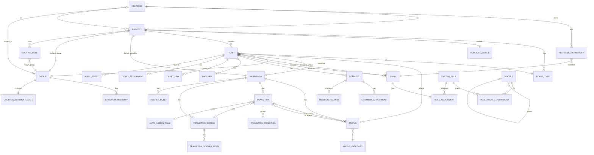

# Entity‑Relationship Design — ITSM Platform

Grounded in the real models under `backend/apps/itsm_*`. Models marked **(built)** exist today (M0/M1); **(planned)** are defined in the plan and will land at the noted milestone.

All ITSM models inherit a shared base:

- **`BaseModel`** = `UUIDModel` + `TimeStampedModel` + `SoftDeleteModel`:
  - `id` UUIDField PK (default `uuid4`)
  - `created_at` (auto, indexed), `updated_at` (auto)
  - `is_deleted` (bool, indexed), `deleted_at`, `deleted_by` (FK User, SET_NULL)
  - Default manager filters `is_deleted=False`; `all_objects` exposes everything; `soft_delete()` / `restore()`.
- A few high‑churn rows (`TicketSequence`) extend plain `models.Model` instead.
- `AuditEvent` extends only `UUIDModel` (append‑only; no soft delete).
- User FK = `accounts.User` (`AUTH_USER_MODEL`).

---

## 1. Mermaid ERD (core domain)

---

## 2. `itsm_core` — shared base, audit, field engine

### AuditEvent **(built)** — append‑only activity feed
| Field | Type | Notes |
|---|---|---|
| id | UUID PK | |
| ticket | FK Ticket | CASCADE, `related_name="activity"` |
| actor | FK User | SET_NULL, nullable |
| action | char(32) | **enum** (22 values, below) |
| field_key | char(80) | optional |
| payload | JSON | snapshot incl. previous values |
| created_at | datetime | indexed |
- **Indexes:** `(ticket, -created_at)`. **Ordering:** `-created_at, -id`.
- **Action enum:** `ticket_created`, `field_changed`, `status_changed`, `assigned`, `group_changed`, `priority_changed`, `comment_added`, `comment_edited`, `comment_deleted`, `attachment_added`, `attachment_removed`, `watcher_added`, `watcher_removed`, `link_added`, `link_removed`, `sla_started`, `sla_paused`, `sla_resumed`, `sla_breached`, `reopened`, `closed`, `template_applied`.
- Written **only** via `services/audit.log_event()` (no signals).

### Field engine **(planned — M3)**
`FieldDefinition` / `FieldOption` / `FieldValue` / `FieldLayout` / `FieldLayoutItem`:
- `FieldDefinition` bound to `(project, ticket_type)`; `field_type` ∈ {text, multiline, number, date, datetime, dropdown, multiselect, checkbox, radio, user_picker, group_picker}; `key`, `label`.
- `FieldOption` — choices for dropdown/multiselect/radio.
- `FieldValue` — **one typed row per `(ticket, field)`** with `value_text / value_number / value_date / value_bool / value_user / value_json`; **unique `(ticket, field)`**; multi‑value lives in `value_json`.
- `FieldLayout` + `FieldLayoutItem` (`order`, `hidden`, `mandatory`, `visibility`) drive the create/detail forms.

---

## 3. `itsm_rbac` — module RBAC **(built)**

### Module
| Field | Type | Notes |
|---|---|---|
| code | char(100) **unique** | dotted, e.g. `itsm.tickets.bulk` |
| name | char(150) | |
| description | text | |
| parent | FK self | SET_NULL, nullable; tree |
| sort_order | uint | |
| is_active | bool | |
- **Indexes:** `code`. **Ordering:** `sort_order, code`.

### SystemRole
| Field | Type | Notes |
|---|---|---|
| code | slug(50) **unique** | `agent`, `supervisor` |
| name | char(100) | |
| description | text | |
| is_system | bool | seeded roles can't be deleted |
| is_active | bool | |
| org | UUID nullable | **reserved** multi‑tenancy hook |

### RoleModulePermission
| Field | Type | Notes |
|---|---|---|
| role | FK SystemRole | CASCADE |
| module | FK Module | CASCADE |
| can_read / can_create / can_update / can_delete | bool ×4 | |
- **Unique constraint:** `(role, module)` (`uniq_role_module`). **Index:** `(role, module)`.

### RoleAssignment
| Field | Type | Notes |
|---|---|---|
| user | **OneToOne** User | CASCADE, `related_name="itsm_role_assignment"` |
| role | FK SystemRole | PROTECT |
- **Index:** `user`. One ITSM role per user.

---

## 3.5 `itsm_helpdesks` — departments / workspaces **(built)**

Multi‑department layer: each **Helpdesk** (IT, HR, …) is a workspace that owns its own projects and namespaced service‑desk group. Visibility is governed by explicit `HelpdeskMembership` — the scoping primitives in `services.py` (`accessible_helpdesk_ids` and friends) clamp every ticket‑facing query by `project__helpdesk_id__in`. Mirrors `itsm_groups` (`Group` / `GroupMembership`).

### Helpdesk
| Field | Type | Notes |
|---|---|---|
| name | char **unique** | |
| key | char(5) **unique** | `KEY_VALIDATOR` `^[A-Z][A-Z0-9]{1,4}$` (2–5 upper); per‑helpdesk ticket‑number prefix (`IT` → `ITINC‑1`) |
| description | text | |
| icon, color | char | |
| status | char | **enum** active / inactive / archived (retire via `status='archived'` — **not** soft delete, which doesn't cascade) |
| created_by | FK User | SET_NULL |
- Accessible set = **active** memberships in **active** helpdesks. Superuser → sentinel `None` (unrestricted).

### HelpdeskMembership
| Field | Type | Notes |
|---|---|---|
| helpdesk | FK Helpdesk | CASCADE |
| user | FK User | CASCADE |
| role_in_helpdesk | char | member / lead |
| is_active | bool | |
- **Unique constraint:** `(helpdesk, user)` (`uniq_helpdesk_user`). **Index:** `(helpdesk, is_active)`.

---

## 4. `itsm_projects` — projects & types **(built)**

### Project
| Field | Type | Notes |
|---|---|---|
| name | char(150) | |
| helpdesk | FK Helpdesk | **CASCADE**, `related_name="projects"`, **non‑null** — the owning department |
| key | char(10) **globally unique** | regex `^[A-Z][A-Z0-9]{1,9}$`; prefixed by helpdesk key (e.g. `ITINC`) |
| description | text | |
| project_type | char(20) | **enum** incident / service_request / custom |
| status | char(12) | active / inactive |
| color, icon | char | |
| default_group | FK Group | SET_NULL |
| default_workflow | FK Workflow | PROTECT |
| lead | FK User | SET_NULL |
| created_by | FK User | SET_NULL |
- **Indexes:** `key`, `(project_type, status)`, `(helpdesk, status)`. **Ordering:** `name`.
- **Partial unique constraint** `uniq_helpdesk_default_projecttype`: `(helpdesk, project_type)` WHERE `project_type ∈ {incident, service_request}` AND `is_deleted=False` — exactly one default Incident + one Request per helpdesk; `custom` projects are unconstrained.
- **Migrations:** `0002_drop_legacy_global_projects` (RunPython drops the old global `INC`/`REQ` + PROTECTed dependents; **its own migration** so the DELETEs commit before the ALTER — else Postgres "pending trigger events") → `0003_project_helpdesk_field` (AddField + index + constraint).

### TicketType
| Field | Type | Notes |
|---|---|---|
| project | FK Project | CASCADE |
| name | char(80) | |
| key | slug(50) | |
| icon | char(32) | |
| base_category | char(20) | incident / service_request |
| parent | FK self | SET_NULL (hierarchical types) |
| is_active, is_default | bool | |
| sort_order | uint | |
- **Unique constraint:** `(project, key)`. **Ordering:** `sort_order, name`.

---

## 5. `itsm_groups` — teams & routing **(built)**

### Group
| Field | Type | Notes |
|---|---|---|
| name | char(150) **unique** | |
| key | slug(50) **unique** | |
| description | text | |
| helpdesk | FK Helpdesk | **SET_NULL, nullable** — `null` = shared/global team; non‑null = a helpdesk‑namespaced group (e.g. `it-service-desk` / "IT Helpdesk Service Desk") |
| type | char(20) | **enum** service_desk / network / infra / security / app_support / custom |
| lead | FK User | SET_NULL |
| is_active | bool | |
- Seed creates one namespaced Service Desk group per helpdesk plus the 4 shared global teams (`helpdesk=null`).

### GroupMembership
| Field | Type | Notes |
|---|---|---|
| group | FK Group | CASCADE |
| user | FK User | CASCADE |
| role_in_group | char(10) | member / lead |
| is_active | bool | |
- **Unique constraint:** `(group, user)`. **Index:** `(group, is_active)`.

### GroupAssignmentState — round‑robin cursor
| Field | Type | Notes |
|---|---|---|
| group | **OneToOne** Group | CASCADE |
| last_assigned_user | FK User | SET_NULL |
- Locked with `select_for_update` during auto‑assignment.

### RoutingRule
| Field | Type | Notes |
|---|---|---|
| project | FK Project | CASCADE, nullable (global rule) |
| name | char(150) | |
| priority | uint | ascending; first match wins |
| match_spec | JSON | `{ticket_type, priority, …}` |
| target_group | FK Group | CASCADE |
| target_assignee | FK User | SET_NULL |
| is_active | bool | |
- **Index:** `(project, priority)`. **Ordering:** `priority, id`.

---

## 6. `itsm_workflows` — workflow graph **(built)**

### StatusCategory — fixed three
| Field | Type | Notes |
|---|---|---|
| key | char(20) **unique** | **enum** todo / in_progress / done |
| name, color, sort_order | | drives queue grouping + reporting |

### Workflow
| Field | Type | Notes |
|---|---|---|
| name | char(150) | |
| description | text | |
| base_type | char(20) | incident / service_request / custom |
| is_default, is_active | bool | |
| version | uint | copy‑on‑publish versioning |
- **Index:** `is_active`.

### Status (workflow node)
| Field | Type | Notes |
|---|---|---|
| workflow | FK Workflow | CASCADE |
| name | char(80) | |
| key | slug(50) | |
| category | FK StatusCategory | PROTECT |
| color | char(16) | |
| sort_order | uint | |
| is_initial | bool | |
| canvas_x, canvas_y | int | builder coordinates |
- **Unique constraint:** `(workflow, key)`. **Index:** `(workflow, sort_order)`.

### Transition (workflow edge)
| Field | Type | Notes |
|---|---|---|
| workflow | FK Workflow | CASCADE |
| name | char(120) | |
| from_status | FK Status | CASCADE, **nullable** = create transition |
| to_status | FK Status | CASCADE |
| is_global | bool | available from any status |
| sort_order | uint | |
| post_functions | JSON list | `[{type, config}]` |
| auto_assign_rule | FK AutoAssignmentRule | SET_NULL |
| screen | FK TransitionScreen | SET_NULL |
- **Index:** `(workflow, from_status)`.

### TransitionCondition (guard)
| Field | Type | Notes |
|---|---|---|
| transition | FK Transition | CASCADE |
| condition_type | char(30) | **enum** role_in / group_member / is_assignee / field_equals |
| config | JSON | |
| negate | bool | |

### TransitionScreen / TransitionScreenField
- `TransitionScreen(workflow, name)`; `TransitionScreenField(screen, field_key, is_mandatory, sort_order)` — fields required when a transition runs (e.g. Resolve → resolution).

### AutoAssignmentRule
| Field | Type | Notes |
|---|---|---|
| name | char(120) | |
| strategy | char(20) | **enum** round_robin / least_loaded / group_lead / fixed_user / keep_current |
| target_group | FK Group | SET_NULL |
| fixed_user | FK User | SET_NULL |
| config | JSON | |

### ReopenRule
| Field | Type | Notes |
|---|---|---|
| workflow | FK Workflow | CASCADE |
| reopen_to_status | FK Status | CASCADE |
| window_days | uint (14) | |
| requires_comment | bool | |

---

## 7. `itsm_tickets` — the hot domain **(built)**

### TicketSequence — locked counter (plain `models.Model`)
| Field | Type | Notes |
|---|---|---|
| project | **OneToOne** Project | CASCADE |
| last_number | uint | bumped under `select_for_update` |

### Ticket — first‑class columns
| Field | Type | Notes |
|---|---|---|
| ticket_number | char(24) **unique** | per‑helpdesk‑prefixed, e.g. `ITINC-123` |
| project | FK Project | PROTECT |
| ticket_type | FK TicketType | PROTECT |
| summary | char(500) | |
| description_html | text | sanitized on save |
| description_text | text | plain mirror |
| requestor | FK User | SET_NULL |
| assigned_group | FK Group | SET_NULL |
| assignee | FK User | SET_NULL |
| status | FK Status | PROTECT |
| workflow | FK Workflow | PROTECT (**snapshot** at create) |
| priority | char(10) | **enum** critical / high / medium / low (default medium) |
| impact | char(10) | priority enum, blank ok |
| urgency | char(10) | priority enum, blank ok |
| resolution | char(120) | |
| due_date | datetime | |
| first_responded_at | datetime | first public reply |
| assigned_at | datetime | |
| resolved_at | datetime | |
| closed_at | datetime | |
| reopen_count | uint | |
| source | char(10) | **enum** agent / portal / email / phone / api |
| created_by | FK User | SET_NULL |
- **Indexes (8):** `(project,status)`, `(assignee,status)`, `(assigned_group,status)`, `(project,status,priority)`, `priority`, `due_date`, `resolved_at`, `ticket_number`. **Ordering:** `-created_at`.

### Watcher
- `(ticket, user)`; **unique** `(ticket, user)`; index `user`.

### TicketLink
- `source_ticket`, `target_ticket`, `link_type` **enum** relates_to / blocks / blocked_by / duplicates / duplicated_by / causes / caused_by. **Unique** `(source, target, link_type)`.

### TicketAttachment / CommentAttachment
- File + `original_name`, `size_bytes`, `content_type`, `uploaded_by`. Upload paths `itsm_attachments/ticket/<id>/…` and `…/comment/<id>/…`.

### Comment
| Field | Type | Notes |
|---|---|---|
| ticket | FK Ticket | CASCADE |
| author | FK User | SET_NULL |
| visibility | char(8) | **enum** public / private (default public) |
| body_html | text | sanitized |
| body_text | text | plain mirror |
| edited_at | datetime | |
- **Indexes:** `(ticket, created_at)`, `(ticket, visibility)`. **Ordering:** `created_at, id`.

### MentionRecord
- `(comment, mentioned_user)`; **unique** `(comment, mentioned_user)`.

### CannedNote / TicketTemplate **(planned — M7)**
- `CannedNote(+Category)` reusable comment snippets; `TicketTemplate(+Category)` prefill specs applied via `apply-template`.

---

## 8. `itsm_sla` **(planned — M5)**
`BusinessCalendar` / `BusinessHours` / `Holiday`; `SLAPolicy` / `SLAMetric` / `SLATarget`; `SLATracker` / `SLAPauseInterval`; `EscalationRule` / `SLAEscalationLog` (unique `(clock, threshold)` for idempotent escalations). See `SLA_ENGINE.md`.

## 9. `itsm_notifications` **(planned — M6)**
`NotificationScheme` / `NotificationRule`; `EmailTemplate`; `InAppNotification`; `NotificationOutbox` (durable queue, unique `dedupe_key`). See `NOTIFICATION_ENGINE.md`.

## 10. `itsm_reporting` **(planned — M9)**
Live query services + nightly snapshot tables: `TicketDailyStat`, `AgentDailyStat`, `SLAComplianceStat`.

## 11. `itsm_dashboards` **(planned — M10)**
`SavedFilter` (JSON `query_spec` → ORM `Q`), `Dashboard`, `Widget`, `DashboardShare`. See `DASHBOARD_FRAMEWORK.md`.

## 12. `itsm_email` — email channel **(built — M13)**
All `BaseModel`; secret columns use `crypto.EncryptedField` (Fernet at rest). See `EMAIL_CHANNEL.md`.

### EmailChannel — a configured mailbox
| Field | Type | Notes |
|---|---|---|
| name | char | label |
| address | email | mailbox address (plus-addressing / self-loop) |
| protocol | char(8) | **enum** imap / pop3 |
| host | char | |
| port | uint | |
| use_ssl | bool | |
| auth_type | char(12) | **enum** basic / google / microsoft |
| username | char | |
| password | **EncryptedField** | basic secret (write-only via API) |
| oauth_access_token | **EncryptedField** | Google/MS XOAUTH2 |
| oauth_refresh_token | **EncryptedField** | drives automatic refresh |
| oauth_token_expires_at | datetime | |
| default_requestor | FK User | SET_NULL; used when `create_users` off |
| create_users | bool | non-login external accounts for unknown senders |
| is_active | bool | polled only when true |
| last_polled_at | datetime | |
- Provider client id/secret live in **settings**, not the DB — only granted tokens persist. **Index:** `is_active`.

### InboundEmail — durable per-message log (the email-logs / failed-requests surface)
| Field | Type | Notes |
|---|---|---|
| channel | FK EmailChannel | CASCADE |
| message_id | char | RFC `Message-ID` |
| from_address | email | |
| subject | char | |
| received_at | datetime | |
| body_text / body_html | text | quote/signature stripped |
| status | char(10) | **enum** received / processed / ignored / failed |
| ignore_reason | char | `auto_reply` / `blocked` / `too_old` / `too_large` / `mail_loop` / `duplicate` |
| action_taken | char | **enum** created_ticket / added_comment / null |
| ticket | FK Ticket | SET_NULL |
| comment | FK Comment | SET_NULL |
| attempts | uint | retry counter (≤ `EMAIL_MAX_INBOUND_ATTEMPTS`) |
| last_error | text | |
| next_retry_at | datetime | |
- **Unique constraint:** `(channel, message_id)` — the idempotency key (POP3 has no stable UID; refetches/restarts never double-create). **Index:** `(channel, status)`.

### EmailThreadMessage — inbound resolution map
| Field | Type | Notes |
|---|---|---|
| ticket | FK Ticket | CASCADE |
| message_id | char | each message's `Message-ID` |
| in_reply_to | char | parent `Message-ID` |
| references | text | the `References` chain |
| direction | char(8) | **enum** inbound / outbound |
- **Index:** `message_id` (the lookup for `In-Reply-To`/`References` resolution).

### EmailRule — per-channel allow/block list
| Field | Type | Notes |
|---|---|---|
| channel | FK EmailChannel | CASCADE |
| rule_type | char(8) | **enum** allow / block (block wins) |
| match_field | char(8) | **enum** from / domain / subject |
| pattern | char | substring/glob |
| is_active | bool | |

---

## 13. Cross‑Cutting Conventions
- **UUID PKs everywhere** (stable external IDs; don't leak row counts in URLs / deep‑links).
- **Soft delete** on all `BaseModel` tables; the API uses `soft_delete` instead of hard DELETE.
- **Config snapshots** on `Ticket` (`workflow` FK chosen at create) so later config edits never strand in‑flight tickets.
- **PROTECT** on FKs whose loss would orphan a ticket (project, ticket_type, status, workflow); **SET_NULL** on people/group FKs.
- **Concurrency:** `TicketSequence` and `GroupAssignmentState` are locked with `select_for_update`.
